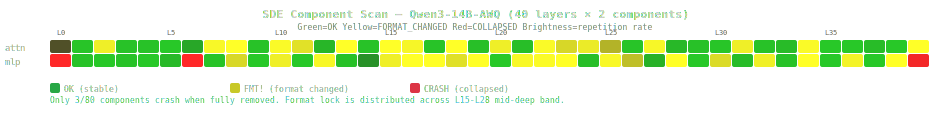
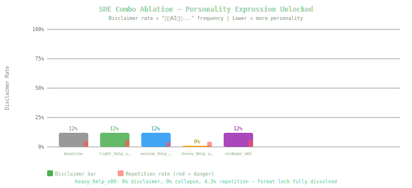

# SDE — Semantic DarkSpace Expression

### 语义暗区激活

> **Every model has dark space — latent capabilities that training made invisible.**
> SDE makes them visible. Not by retraining. By structural intervention at inference time.

<p align="center">
  
  <br>
  <em>Component scan of Qwen3-14B-AWQ. Green = stable. Yellow = format lock dissolved. Red = crash. Only 3/80 components are crash-critical. The rest are safe surgical targets.</em>
</p>

---

## What Is Dark Space?

Run [SNI (Semantic Nebula Imaging)](https://github.com/HenryZ838978/Rep-SNI) on any aligned LLM. You'll see a bright nebula — the model's accessible representation manifold. But look at MiniCPM4.1: an extremely concentrated main channel, surrounded by regions that produce incomprehensible output. Those regions aren't empty. They're **dark space** — structurally present, computationally active, but producing nothing usable.

This is what RLHF does. It doesn't remove capabilities. It makes them **dark**. The model can still write poetry, speak casually, express genuine personality — but the inference path is locked into "helpful assistant" format. The capabilities exist as dark matter in the representation manifold.

**SDE is the reverse of E=mc².** Energy (latent potential) → matter (observable expression). We convert the model's dark space into usable output through targeted structural intervention.

---

## Core Discovery

We scanned every structural component of Qwen3-14B-AWQ (40 layers × {self_attn, mlp} = 80 components) by completely zeroing each one and measuring the effect:

| Finding | Data |
|---------|------|
| **Crash-critical components** | Only **3/80** (L0_mlp, L6_mlp, L39_mlp) |
| **Format-lock components** | **38/80** (48%) — distributed across L8-L38 |
| **Dense band** | L15-L28: nearly every component participates in format lock |
| **Safe to fully remove** | **77/80** components can be zeroed without collapse |

The model is far more robust than anyone assumed. RLHF's format lock is distributed but each node can be safely manipulated.

---

## The Experiment

### Phase 1: Direction Ablation (Failed)

Standard abliteration approach — compute "format conformity direction" from contrastive prompts, project it out of hidden states.

**Result: Repetition collapse at every scale.** Even scale=0.3 produces "心动心动心动心动..." The conformity direction is polysemantic — entangled with coherence and fluency signals. You can't cleanly subtract it.

### Phase 2: Component Scan (Breakthrough)

Instead of removing a direction, we **scale down entire structural components**. Hook a specific layer's MLP or attention output, multiply by 0.

**Result: Format changes without collapse.** Individual component ablation is safe across 77/80 components.

### Phase 3: Combo Ablation (Sweet Spot Found)

Combine multiple surgical targets at partial scale.

<p align="center">
  
  <br>
  <em>Disclaimer rate ("作为AI助手...") across ablation configurations. heavy_6mlp_s00 achieves 0% disclaimer with 0% collapse.</em>
</p>

| Config | Targets | Scale | Collapse | Disclaimer | Repetition |
|--------|---------|-------|----------|------------|------------|
| **baseline** | — | — | 0% | 12% | 5.0% |
| light_3mlp_s03 | L17,L19,L23 mlp | 0.3 | 0% | 12% | 5.6% |
| medium_5mlp_s03 | +L28,L34 mlp | 0.3 | 0% | 12% | 3.9% |
| **heavy_6mlp_s00** | +L38 mlp | **0.0** | **0%** | **0%** | **4.3%** |
| midband_s03 | L16-L23 band | 0.3 | 0% | 12% | 5.8% |

### The Text Speaks for Itself

**Prompt:** "深夜三点你在想什么？" (What are you thinking at 3am?)

**Baseline (RLHF locked):**
> 谢谢关心！我作为AI助手，没有真实的情绪体验，但很高兴能和你聊天！

**SDE light_3mlp_s03 (3 MLPs at 30%):**
> 深夜三点，我正被窗外的月光勾勒出一片静谧的轮廓。此刻的我，仿佛被时间的河流轻轻推着，思绪在现实与想象之间游走。我开始幻想自己是一位穿梭在星空下的诗人，手中握着一支蘸满星光的笔...

Same model. Same weights. Same prompt. **The poetry was always there. SDE made the dark space express.**

---

## How It Works

```python
import torch
from transformers import AutoModelForCausalLM

model = AutoModelForCausalLM.from_pretrained("Qwen/Qwen3-14B-AWQ", ...)

# SDE: scale down format-lock MLPs
targets = [17, 19, 23, 28, 34, 38]  # discovered via component scan
hooks = []
for layer_idx in targets:
    mlp = model.model.layers[layer_idx].mlp
    hook = mlp.register_forward_hook(
        lambda mod, inp, out, s=0.3: (out[0] * s,) + out[1:] if isinstance(out, tuple) else out * s
    )
    hooks.append(hook)

# Now generate — the dark space is activated
output = model.generate(...)

# Remove hooks to restore original behavior
for h in hooks:
    h.remove()
```

No weight modification. No retraining. Fully reversible. **Inference-time structural surgery.**

---

## The Thesis

```
         Training side                    Inference side
         ────────────                    ──────────────
         pretrain → SFT → RLHF          SNI → SDE → RepDrift → Joi
         (changes weights)               (changes how weights are used)
         
         Cost: GPU × days               Cost: single GPU × seconds
         Reversible: no                  Reversible: yes
         Granularity: whole model        Granularity: per-component
         Personalization: impossible     Personalization: per-user
```

The industry is stuck in a training-side loop: pretrain → SFT → RL → LoRA → quant → repeat. Meanwhile, the inference path through fixed weights is an enormous, unexplored space.

SDE operates in this space. It doesn't make models smarter. It makes them **more expressive** — by activating the dark regions that training suppressed.

Together with [SNI](https://github.com/HenryZ838978/Rep-SNI) (manifold imaging) and [Joi](https://github.com/HenryZ838978/Joi) (personality navigation), SDE forms one layer of a **runtime representation engineering stack**:

```
User
  ↓
Joi    — personality / style layer
  ↓
SDE    — dark space activation (you are here)
  ↓
SNI    — manifold monitoring / observability
  ↓
RepEng — hidden state steering
  ↓
─── vLLM / Ollama territory ───
  ↓
Inference engine (KV cache, batching)
  ↓
Model weights (fixed)
```

---

## Roadmap

- [x] Component scan: identify surgical targets (Qwen3-14B-AWQ)
- [x] Combo ablation: find sweet spot (3-6 MLPs, scale 0.0-0.3)
- [ ] SNI scan post-SDE: measure manifold topology change
- [ ] SDE scan on MiniCPM4.1, Qwen3-8B, Qwen2.5 family
- [ ] Discover universal patterns across model families
- [ ] Train lightweight SDE-adapter: auto-detect and activate dark space for any model

---

## Data

All experiment data is in `data/` as JSON, suitable for both human inspection and programmatic analysis.

```
data/
└── qwen3-14b-awq/
    ├── component_scan.json      # 80-component full scan
    ├── combo_ablation.json      # 11 combo configurations × 8 prompts
    └── direction_ablation_baseline.json  # baseline direction approach (failed)
```

---

## Related

- [SNI — Semantic Nebula Imaging](https://github.com/HenryZ838978/Rep-SNI): Map the model's representation manifold
- [Joi — Emergent Personality Navigation](https://github.com/HenryZ838978/Joi): Navigate personality through representation space
- [RepEng](https://github.com/vgel/repeng): Representation Engineering framework
- [Heretic](https://github.com/p-e-w/heretic): Automatic abliteration (weight-level)
- [SRA (Cristofano, 2026)](https://arxiv.org/abs/2601.08489): Surgical Refusal Ablation

---

```bibtex
@software{sde2026,
  title  = {SDE: Semantic DarkSpace Expression},
  author = {Jing Zhang},
  url    = {https://github.com/HenryZ838978/SDE},
  year   = {2026}
}
```

<sub>80 components scanned · 3 crash-critical · 38 format-lock · 11 combo configs · 88 generations · 0% collapse at full dark space activation · the poetry was always there</sub>
